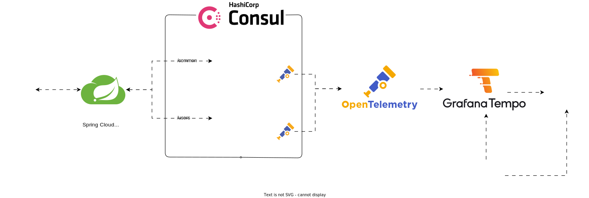

# Microservices-Tutorial
This project is a tutorial on how to build microservices using Spring Boot and Spring Cloud Gateway. It also includes a basic setup for monitoring using OpenTelemetry, Grafana, Tempo, and Prometheus.

## Technologies:

- Java 17
- Spring Boot
- Spring Cloud Gateway
- Consul
- OpenTelemetry, Grafana, Tempo, Prometheus
- Docker

## Architecture



## Installation

### Prerequisites

- Docker installed
- Any IDE of your choice

### Step-by-step Guide

To install and run the project, follow these steps:
1. Clone the repository
```bash
git clone https://github.com/mochacr0/microservices-tutorial.git
```
2. Build and start the Docker containers:
```bash
docker compose up
```
3. Once the Docker containers are up and running, you can access the services using the following URLs:
   
   - Consul: http://localhost:8500
   - Gateway: http://localhost:8080
   - Common Service: http://localhost:8080/common
   - User Service: http://localhost:8080/users
   - Grafana: http://localhost:3000
   - Prometheus: http://localhost:9090
4. To stop the Docker containers, run the following command:
```bash
docker compose down
```